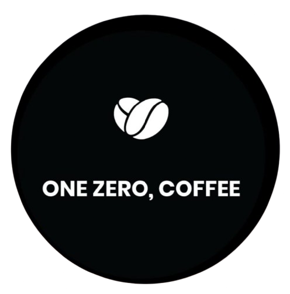

# ☕ One Zero Coffee (Frontend)

<div align="center">
  
  
  <h3>Artisan Roasters & Interactive Digital Café Experience</h3>
  
  <p>
    An ultra-premium, high-performance web experience built for modern coffee lovers. Combining frame-by-frame scroll animations, rich glassmorphic aesthetics, and dynamic state management.
  </p>

  <!-- Tech Badges -->
  <p>
    
    
    
    
    
    
    
    
    
    
  </p>
</div>

---

## 🌟 Key Features

### 1. Interactive GSAP Canvas Hero
* **Smooth Frame Scrubbing**: Implements an optimized HTML5 `2D Canvas` rendering pipeline that pre-loads 240 custom high-definition JPG frames.
* **ScrollTrigger Bindings**: Binds scroll position directly to frame index interpolations, creating a cinematic zoom-in effect.
* **DPR Aware Scaling**: Calculates `devicePixelRatio` to prevent blurring on Retina and high-resolution screens.
* **Staggered Text Overlays**: Fades and slips header elements into view at custom scroll markers using GSAP timeline staggers.

### 2. Immersive Micro-Animations
* **Atmospheric Bean Trail**: Rendered using a declarative vector particle system (`BeanTrail`) animating rotating, blurred, and semi-transparent coffee beans.
* **Scroll-Linked Entrance Effects**: Wrap page elements in custom `<FadeIn>` wrappers leveraging `framer-motion` `useInView` hooks.
* **Steam Effect Simulation**: Floating CSS-particle keyframe animations that represent rising steam above coffee cups.

### 3. Client-Side Order & Cart Engine
* **Reactive Categories**: Quick filters to sort between `Coffee`, `Cold Drinks`, and `Snacks`.
* **Zustand Store Integration**: Manages the local cart lifecycle synchronously with simple API hooks (`addItem`, `removeItem`, `updateQuantity`).
* **Visual Add Confirms**: Micro-state triggers that temporarily replace the "Add" action with a checkout confirmation checkmark.
* **Toast Dispatchers**: High-priority feedback alerts implemented via Radix UI primitives and the `sonner` framework.

### 4. Admin Dashboard Portal
* **Demo Gatekeeper**: Shielded behind an access screen authenticated by password `admin123`.
* **Real-time Status Control**: Change order workflow statuses between `Pending`, `Preparing`, and `Completed` with instantly updating UI badges.
* **Editable Menu Management**: Simulated dashboard to add and configure stock state of menu items.

---

## 📁 Repository Directory Structure

The structure of the `src/` application follows a standard modular layout:

```text
src/
├── assets/             # Raw media assets (images, coffee cup frames, wallpapers)
├── components/         # Global layout and UI modules
│   ├── ui/             # Reusable design system primitives (Radix slots, buttons)
│   ├── Footer.tsx      # Premium navigation footer component
│   ├── Navbar.tsx      # Sticky glassmorphic header and mobile drawer
│   ├── ScrollCanvas.tsx# GSAP Canvas rendering & ScrollTrigger timeline engine
│   └── ScrollToTop.tsx # React Router utility to reset viewport scroll positions
├── hooks/              # Custom hooks directory
│   └── use-toast.ts    # React state utility to dispatch UI toasts
├── lib/                # App logic utilities and state stores
│   ├── menu-data.ts    # Static configuration of coffee and food items
│   ├── store.ts        # Zustand global state definitions and interfaces
│   └── utils.ts        # Tailwind merging classes helpers (clsx & twMerge)
├── pages/              # Main routing views
│   ├── AboutPage.tsx   # Informative brand story & values page
│   ├── AdminPage.tsx   # Simulative portal for orders and stock management
│   ├── Index.tsx       # Routing anchor pointing to LandingPage
│   ├── LandingPage.tsx # Master layout orchestrating GSAP and Framer motion sections
│   ├── MenuPage.tsx    # Interactive menu shop, filter tab, and cart sidecar
│   └── NotFound.tsx    # Branded 404 handler page
├── App.tsx             # Providers wrapper (QueryClient, Toaster, React Router)
├── index.css           # Styling entries, CSS animations, variables, and Tailwind directives
└── main.tsx            # Project root bootstrap
```

---

## ⚙️ Tech Stack & Dependencies

### Core Frontend
* **[React 18](https://react.dev/)** - Frontend UI library.
* **[TypeScript](https://www.typescriptlang.org/)** - Strict type checking.
* **[Vite](https://vitejs.dev/)** - Fast dev server and asset bundle builder.

### Styles & Design System
* **[Tailwind CSS](https://tailwindcss.com/)** - Utility-first styling framework.
* **[Lucide React](https://lucide.dev/)** - Modern minimalist svg icon set.
* **[Radix UI Primitives](https://www.radix-ui.com/)** - Unstyled accessible helpers (slots, tooltips, toasts).
* **[Glassmorphism Utilities](https://tailwind-merge.vercel.app/)** - Custom backdrop-filters and frosted borders matching a warm dark chocolate palette.

### Animations
* **[GSAP (GreenSock)](https://greensock.com/gsap/)** - High performance animation suite.
* **[ScrollTrigger Plugin](https://greensock.com/scrolltrigger/)** - Controls canvas timeline scrubbing based on viewport position.
* **[Framer Motion](https://www.framer.com/motion/)** - Staggered entrance animations and layout state animations.

### State Management
* **[Zustand](https://github.com/pmndrs/zustand)** - Minimalist store framework handling shopping basket collections and item logic.
* **[TanStack Query v5](https://tanstack.com/query/latest)** - Handles remote query caching.

---

## 🚀 Getting Started

### Prerequisites
* **Node.js** (v18 or higher recommended)
* **npm** or **yarn**

### Installation

1. Clone the repository and navigate to the directory:
   ```bash
   git clone <repository-url>
   cd OneZeroCoffee
   ```

2. Install dependencies:
   ```bash
   npm install
   ```

3. Start the Vite local development server:
   ```bash
   npm run dev
   ```
   *The server will usually be available at `http://localhost:5173/`.*

### Available Scripts
* `npm run dev`: Starts the local dev server.
* `npm run build`: Bundles optimized production-ready assets into the `dist/` directory.
* `npm run build:dev`: Bundles assets using Vite development mode configs.
* `npm run lint`: Performs lint validation checking across TSX files.
* `npm run preview`: Launches a server to preview production build scripts locally.

---

## ☕ Implementation Highlights

### ⚡ Canvas Frame-Preloading (ScrollCanvas)
To prevent flickering or latency during fast scrolling, frames are pre-loaded in memory using standard `Image` constructor pipelines before triggering GSAP ScrollTrigger:

```typescript
// Pre-load frames mapping to canvas buffer
const images: HTMLImageElement[] = [];
for (let i = 0; i < FRAME_COUNT; i++) {
  const img = new Image();
  img.src = `/frames/ezgif-frame-${String(i + 1).padStart(3, '0')}.jpg`;
  img.onload = () => {
    loadedCount++;
    if (loadedCount === 1) renderFrame(0); // Show initial frame instantly
  };
  images.push(img);
}
```

### 🛒 Zustand Cart State (store.ts)
A centralized store manages the cart item additions, quantity modifications, and total computations, eliminating prop-drilling across the product grid:

```typescript
export const useCartStore = create<CartStore>((set, get) => ({
  items: [],
  addItem: (item) => set((state) => {
    const existing = state.items.find((i) => i.item.id === item.id);
    if (existing) {
      return {
        items: state.items.map((i) =>
          i.item.id === item.id ? { ...i, quantity: i.quantity + 1 } : i
        ),
      };
    }
    return { items: [...state.items, { item, quantity: 1 }] };
  }),
  total: () => get().items.reduce((sum, i) => sum + i.item.price * i.quantity, 0),
}));
```

---

## 🎨 Styling Decisions & Themes

* **Main Palette**: Deep browns (`#2A1B14`, `#1B110A`) mixed with high-vibrancy caramel accent highlights (`#D46B25`, `#E6A87C`).
* **Interactive Overlays**: Frosted-glass backdrop-filters (`backdrop-blur-md`) with semi-transparent white borders (`border-white/10`) to highlight active containers.
* **Layout Structure**: Custom typography utilizing responsive mobile-to-desktop fluid layouts.

---
<div align="center">
  <sub>Developed for the premium coffee connoisseur. Built with passion and code.</sub>
</div>
